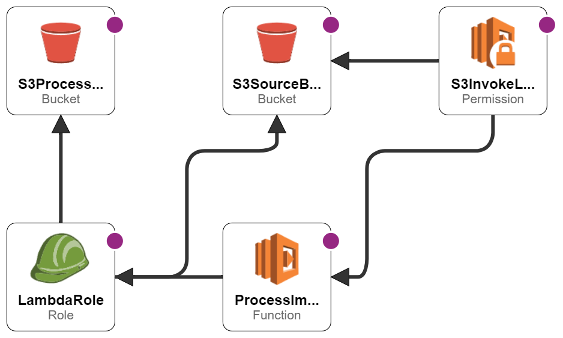

# The thumbnail generator on AWS

* The pourpoise is provide the step-by-step guide to implement a thumbnail generator using AWS Cloudformation
* The pipeline to use will be:
  
  S3(Source) --> |Object Upload| Lambda (Trigger) --> |Start Function| Lambda (Processing) --> |Get Object| S3(Source Image)
  
* We will considered the schematic option from Cloud formation and the yaml snipset.
* The lambdaLayer folder will not be updated here, that's because doesn't make sense to put the PIL and boto3.

## Step-by-Step
* Create a S3 bucket to save your .zip lambda_handler.py and the ThumbnailGenerator.py scripts.
* Create a lambda layer:
  - You can do this by downloading the needed libraries (PIL & boto3) in a local folder, then save those in a .zip file and update this one through the AWS Console.
  - Copy the arn from the layer, that will be used on the yamal file
* Crete the ThumbnailGenerator script, it just a script that receives an object from the lambda_handler. You can see a simple example of this in the [ThumbnailGenerator.py](lambdaHandler/ThumbnailGenerator.py)
* Create the lambda handler:
  - You will need to retrieve the bucket and the name from the event itself.
  - To get the object create an s3_cliennt, and then use the get_object method with the bucket and name.
  - Create a ThumbnailGenerator object and then upload the thumbnail on a S3 bucket of your preference.
  - For an example, take a look at [lambda_handler.py](lambdaHandler/lambda_handler.py)
* Zip those two files and save it on a S3 bucket
* Finally consider the yanl structure that fullfil the pipeline, an example on [thumbnail.yaml](CloudFormation/thumnail2.yaml)

## Other approach: 
* sign the desing section on the Cloudformation tool and stablish the conections, an [example](CloudFormation/thumnailGen.png)

## Pipeline from the yamal file

## Some thumbnails generated
 
 
 

## Resources used:
* **Python version:** 3.8
* **Packages:** PIL and boto3
* Based on a test for a job as data engineer

